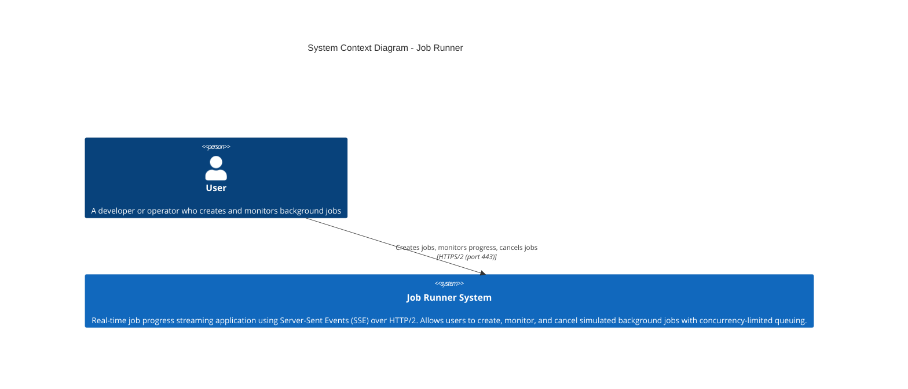

# C1 - System Context Diagram

The highest-level view showing the Job Runner system and its interactions with external actors.

## Description

The Job Runner is a self-contained proof-of-concept system that demonstrates real-time job progress streaming via Server-Sent Events over HTTP/2. It has no external system dependencies — all state is held in-memory.

An nginx reverse proxy terminates TLS and serves HTTP/2 to the browser, removing the HTTP/1.1 six-connection-per-origin limit that would otherwise restrict the number of concurrent SSE streams.

Jobs are concurrency-limited (max 5 running simultaneously). Additional jobs are queued in a PENDING state and automatically promoted to RUNNING as slots free up.

### Actors

| Actor | Description |
|-------|-------------|
| User  | A developer or operator who interacts with the dashboard to create background jobs, watch their real-time progress, and optionally cancel them |

### External Systems

None. The Job Runner is entirely self-contained with no database, message queue, or third-party service integrations.
