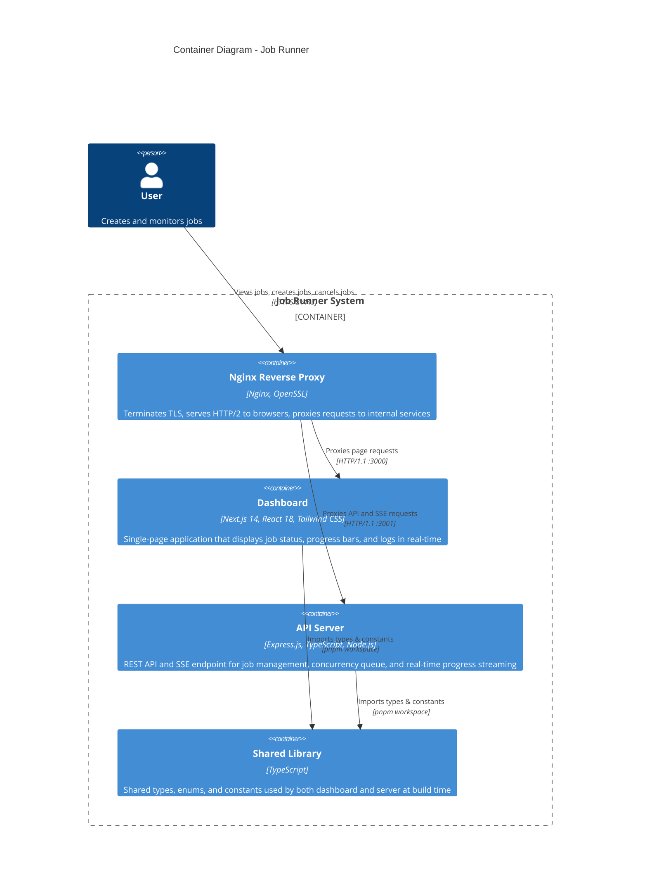

# C2 - Container Diagram

Shows the high-level technology choices and how the containers communicate.

## Container Details

| Container | Technology | Purpose |
|-----------|-----------|---------|
| Nginx Reverse Proxy | Nginx (Alpine), OpenSSL | TLS termination, HTTP/2 multiplexing, reverse proxy to internal services, HTTP→HTTPS redirect |
| Dashboard | Next.js 14 (App Router), React 18, Tailwind CSS | Client-side rendered SPA that polls for job lists and subscribes to SSE streams for active job progress |
| API Server | Express.js 4, TypeScript, Node.js | Handles REST endpoints for CRUD operations, manages job concurrency queue (max 5), and serves SSE streams for real-time progress updates |
| Shared Library | TypeScript | Build-time dependency providing `Job`, `JobStatus`, `ProgressEvent`, `ApiResponse` types and configuration constants |

## Communication Patterns

1. **Browser → Nginx**: All traffic enters via HTTPS on port 443 (HTTP/2). Port 80 redirects to HTTPS.
2. **Nginx → Dashboard**: Proxies `/` to Next.js on port 3000 (HTTP/1.1 internal)
3. **Nginx → API Server**: Proxies `/api/*` and `/health` to Express on port 3001 (HTTP/1.1 internal, buffering disabled for SSE)
4. **REST API**: `POST /api/jobs`, `GET /api/jobs`, `GET /api/jobs/:id`, `POST /api/jobs/:id/cancel`
5. **SSE Stream**: `GET /api/jobs/:id/stream` — pushes `progress` events with percentage, status, and logs
6. **Polling Fallback**: Dashboard polls `GET /api/jobs` every 2 seconds for the full job list

## Why HTTP/2?

Under HTTP/1.1, browsers limit concurrent connections to 6 per origin. Each SSE stream holds an open connection, so monitoring more than 6 jobs simultaneously would cause new streams to queue. HTTP/2 multiplexes all requests over a single TCP connection, removing this limit entirely.

## Deployment

All containers are Dockerized and orchestrated via Docker Compose on a shared bridge network (`job-runner-network`):
- Nginx depends on the server health check and dashboard being started
- Self-signed TLS certificate is generated at Docker build time
- No ports are exposed directly from the server or dashboard containers
