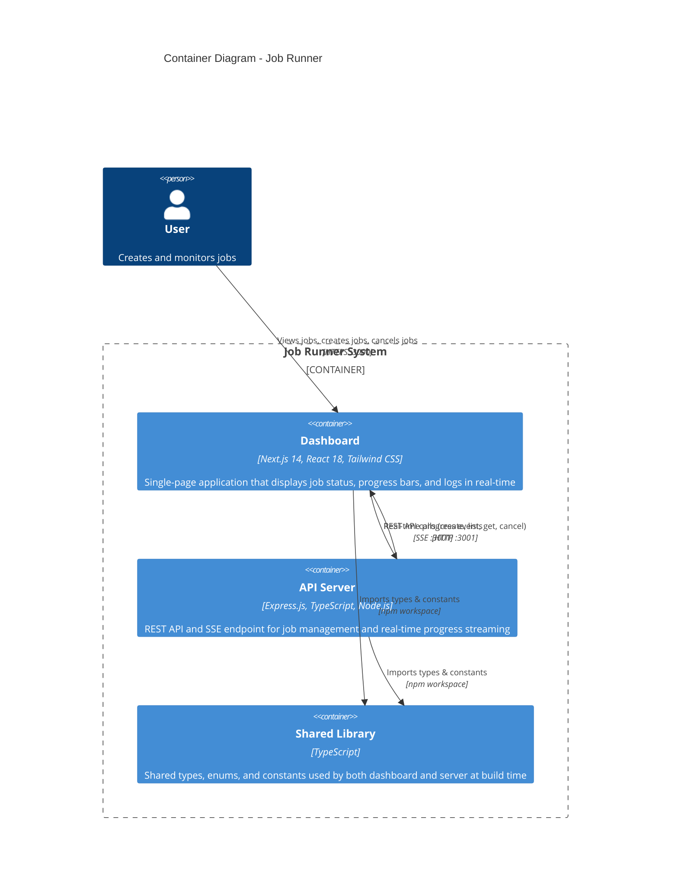

# C2 - Container Diagram

Shows the high-level technology choices and how the containers communicate.

## Container Details

| Container | Technology | Purpose |
|-----------|-----------|---------|
| Dashboard | Next.js 14 (App Router), React 18, Tailwind CSS | Client-side rendered SPA that polls for job lists and subscribes to SSE streams for active job progress |
| API Server | Express.js 4, TypeScript, Node.js | Handles REST endpoints for CRUD operations and serves SSE streams for real-time progress updates |
| Shared Library | TypeScript | Build-time dependency providing `Job`, `JobStatus`, `ProgressEvent`, `ApiResponse` types and configuration constants |

## Communication Patterns

1. **REST API** (Dashboard → Server): `POST /api/jobs`, `GET /api/jobs`, `GET /api/jobs/:id`, `POST /api/jobs/:id/cancel`
2. **SSE Stream** (Server → Dashboard): `GET /api/jobs/:id/stream` — pushes `progress` events with percentage, status, and logs
3. **Polling Fallback**: Dashboard polls `GET /api/jobs` every 2 seconds for the full job list

## Deployment

Both containers are Dockerized and orchestrated via Docker Compose on a shared bridge network (`job-runner-network`). The dashboard depends on the server's health check passing before starting.
