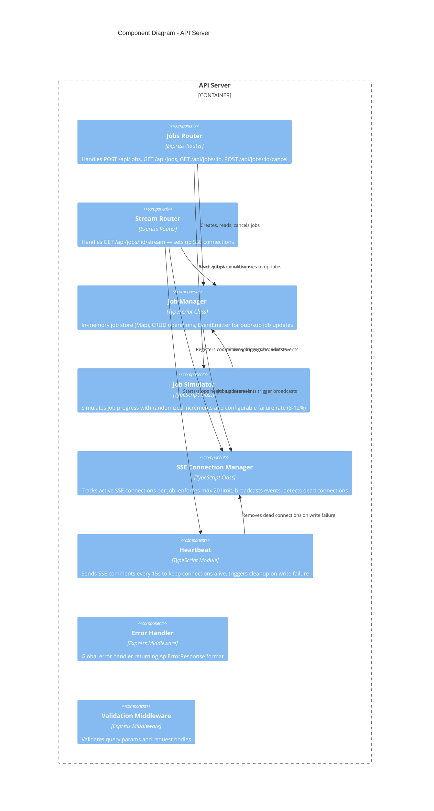
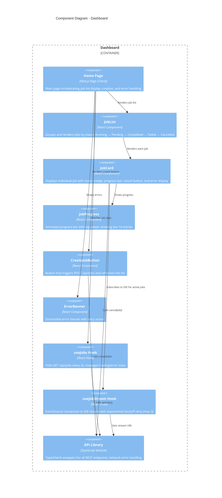

# C3 - Component Diagram

Zooms into each container to show internal components and their responsibilities.

## API Server Components

## Dashboard Components

## Component Responsibilities

### Server Components

| Component | Responsibility |
|-----------|---------------|
| Jobs Router | REST CRUD endpoints for job lifecycle management |
| Stream Router | SSE endpoint setup, initial event dispatch, connection lifecycle |
| Job Manager | Central state store, event bus for job updates, UUID generation |
| Job Simulator | Async progress simulation with setTimeout chains, random failure injection |
| SSE Connection Manager | Connection pooling, limit enforcement (max 20), fan-out broadcasting |
| Heartbeat | Keep-alive mechanism, dead client detection |
| Error Handler | Consistent error response formatting |
| Validation Middleware | Input sanitization for query params and request bodies |

### Dashboard Components

| Component | Responsibility |
|-----------|---------------|
| Home Page | Top-level orchestration, state management |
| JobList | Status-based grouping and ordering |
| JobCard | Individual job UI with real-time updates |
| JobProgress | Visual progress indicator and log display |
| CreateJobButton | Job creation trigger |
| ErrorBanner | User-facing error communication |
| useJobs | Polling-based data fetching |
| useJobStream | SSE connection management with retry logic |
| API Library | HTTP abstraction layer with typed responses |
