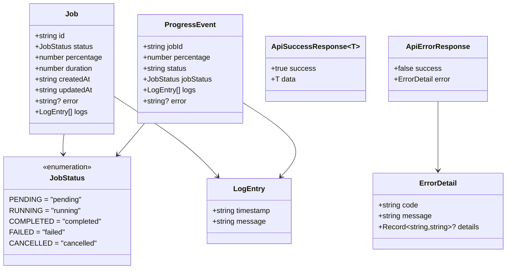
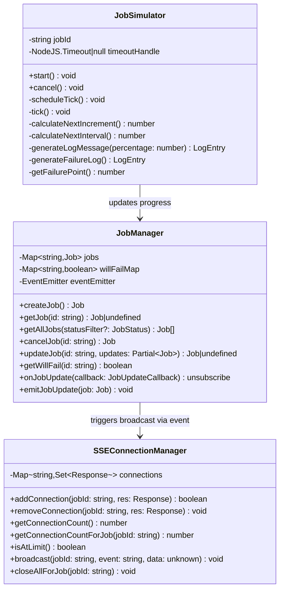
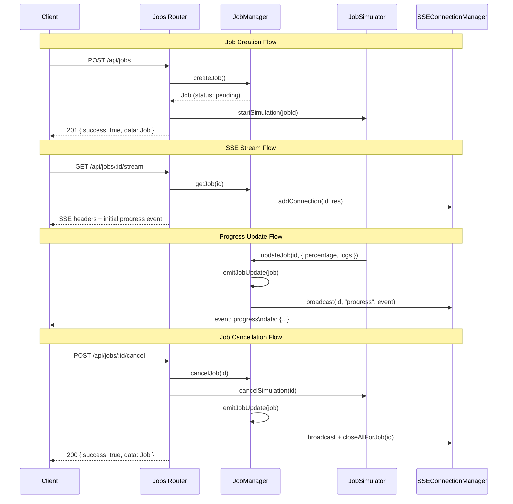
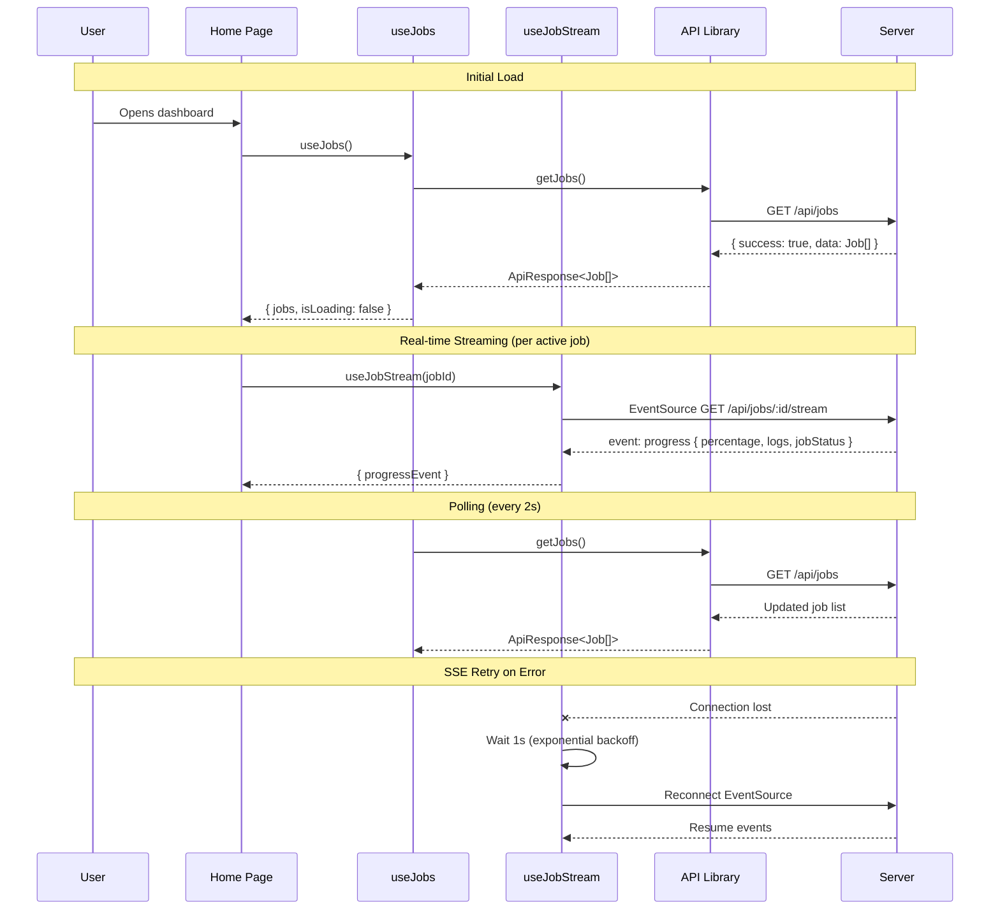
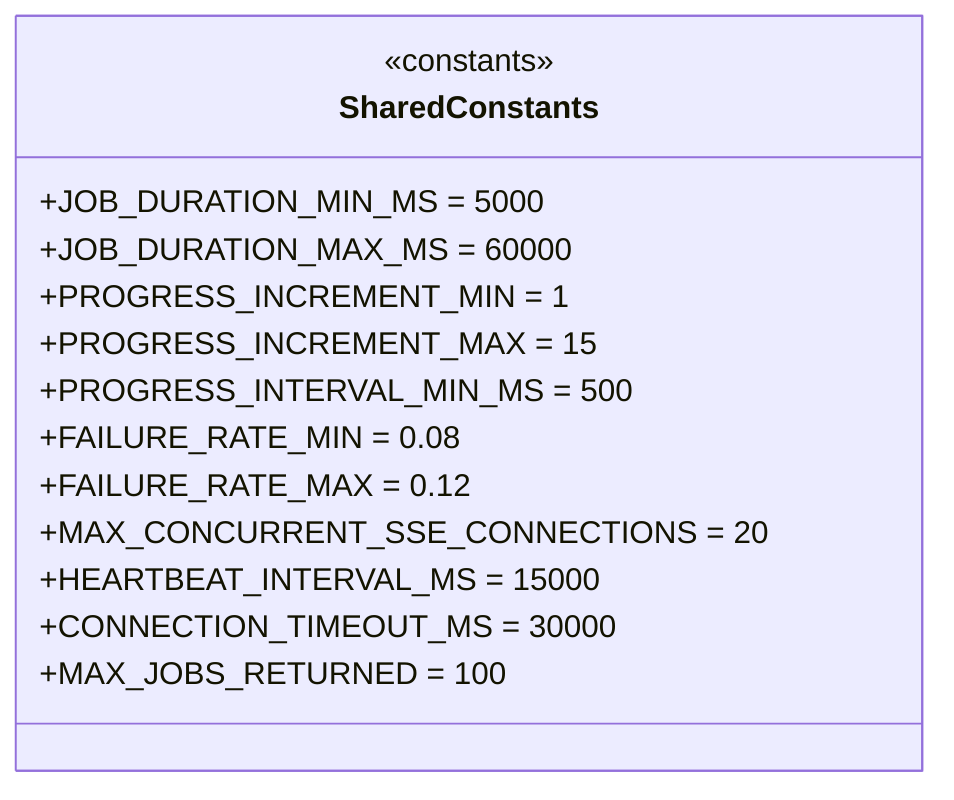

# C4 - Code Diagram

The most detailed level, showing key class structures, interfaces, and data flow.

## Core Data Model



## Server - Job Manager



## Server - Request Flow



## Dashboard - Hook & Component Interaction



## Key Constants



## File Structure Map

```
packages/
├── shared/src/
│   ├── types.ts          → Job, JobStatus, ProgressEvent, ApiResponse
│   ├── constants.ts      → All numeric configuration values
│   └── index.ts          → Re-exports
├── server/src/
│   ├── index.ts          → Express app setup, middleware, route mounting
│   ├── routes/
│   │   ├── jobs.ts       → CRUD endpoints (POST, GET, GET/:id, POST/:id/cancel)
│   │   └── stream.ts     → SSE endpoint (GET /:id/stream)
│   ├── services/
│   │   ├── jobManager.ts → JobManager class (state + events)
│   │   └── simulator.ts  → JobSimulator class (progress engine)
│   ├── sse/
│   │   ├── connectionManager.ts → SSEConnectionManager class
│   │   └── heartbeat.ts  → startHeartbeat / stopHeartbeat
│   └── middleware/
│       ├── errorHandler.ts → Global error middleware
│       └── validation.ts   → Query/body validation factories
└── dashboard/src/
    ├── app/
    │   ├── page.tsx       → Home page (client component)
    │   ├── layout.tsx     → Root layout
    │   └── globals.css    → Tailwind imports
    ├── components/
    │   ├── CreateJobButton.tsx
    │   ├── JobList.tsx
    │   ├── JobCard.tsx
    │   ├── JobProgress.tsx
    │   └── ErrorBanner.tsx
    ├── hooks/
    │   ├── useJobs.ts     → Polling hook
    │   └── useJobStream.ts → SSE hook
    └── lib/
        └── api.ts         → Typed fetch wrappers
```
